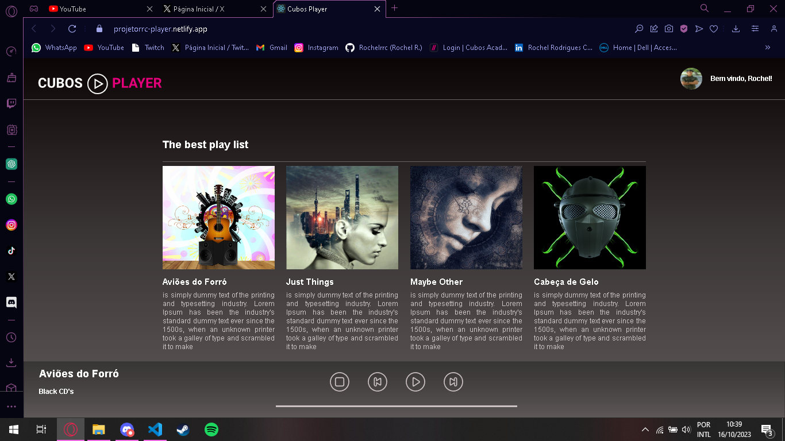

# Desafio Módulo 3- Cubos Player

Esse desafio consistia em desenvolver um player de músicas, com referência no figma [link](https://www.figma.com/file/2RRh9uG0Mjj6p4p6ekVnNp/Cubos-Player?node-id=0%3A1).

Ao abrir o site, basta clicar na capa da música que quer ouvir e ela ira começar a tocar.

Os controles possuem uma funcionalidade padrão que são(da esquerda para a direita): botão de stop(para a música e volta ao começo dela), botão prev(volta para a música anterior ou, caso não haja anterior, passa a música da outra ponta), botão play/pause(inicia e pausa a musica), botao de next(tem funcionalidade similar ao prev, porém avançando na playist.).

## Test
Link para teste: https://projetorrc-player.netlify.app

## Preview

-Layout inicial:

-Botão Play/Pause: 

  

-Botão Stop:

-Botão Prev/Next:

